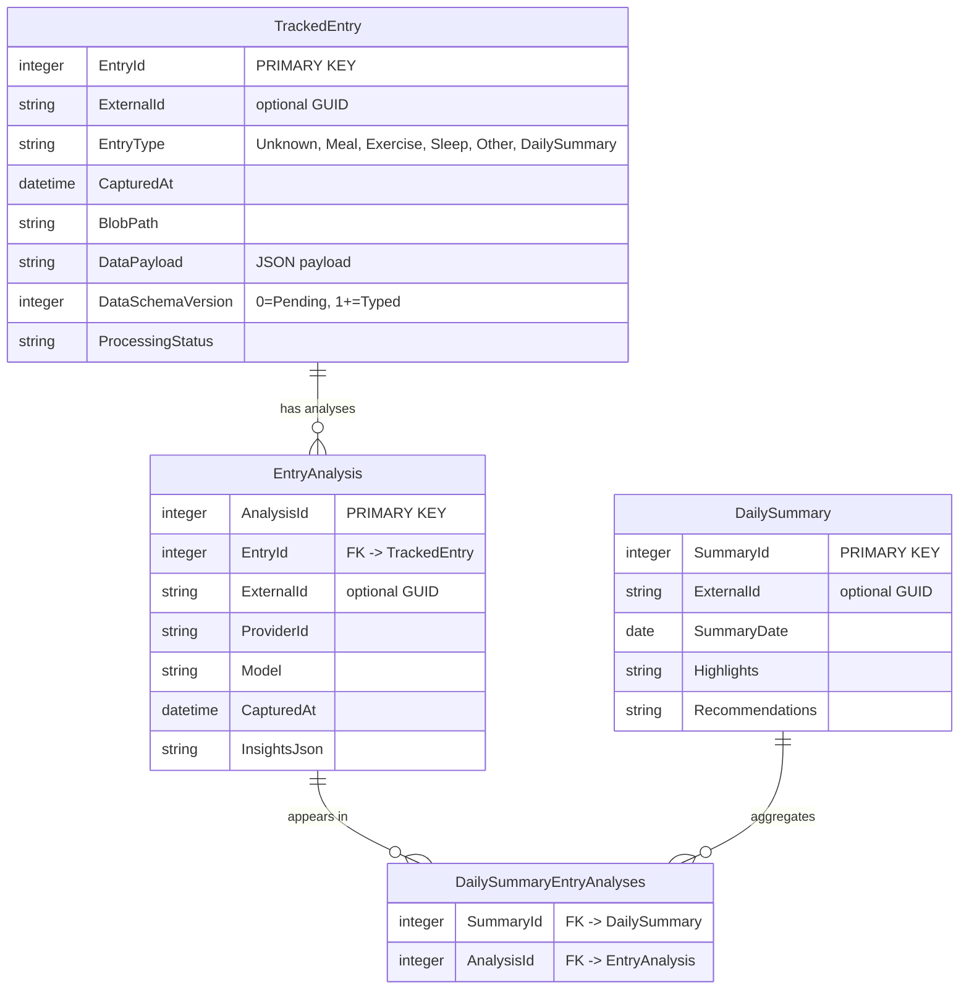
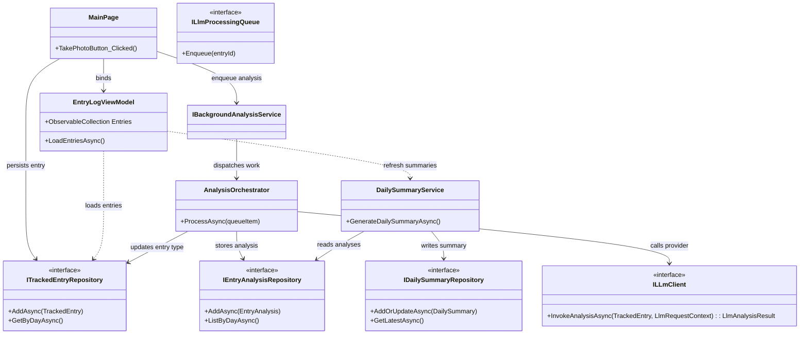

# WellnessWingman Architecture

## Capture-to-Insight Flow

## Purpose & Scope
WellnessWingman is a cross-platform .NET MAUI app that captures wellbeing signals (meals today, exercise and sleep tomorrow), enriches them with user-selected LLM insights, and surfaces daily summaries. This doc outlines system layers, data flow, and extensibility points so enhancements preserve the capture → analysis → summary pipeline.

## Layered Application Structure
- **UI Layer**: `Pages/` houses XAML views and `PageModels/` supplies presentation logic (e.g., `MainPage` + `EntryLogViewModel`). The home feed binds to a single `ObservableCollection<TrackedEntryCard>` that mixes pending captures, meals, exercise sessions, and other cards while a template selector renders the right visual for each type.
- **Domain Models**: `Models/` defines records with a shared `TrackedEntry` root (`int EntryId`, `Guid? ExternalId`, `EntryType` enum, `CapturedAt`, `IEntryPayload Payload`, `DataSchemaVersion`). Entry types start as `EntryType.Unknown` with `PendingEntryPayload`, then the LLM classifies them and payloads migrate to type-specific implementations (`MealPayload`, `ExercisePayload`, `SleepPayload`). The `EntryType` enum provides compile-time type safety. Persist payloads as JSON via repository serializers with schema versioning (0=Pending, 1+=Typed). Analysis entities (`EntryAnalysis`, `DailySummary`, `UnifiedAnalysisResult`) live here as well.
- **Services & Utilities**: Capture orchestration, storage adapters, and LLM provider clients belong under `Utilities/` or a dedicated `Services/` folder and are registered centrally in `MauiProgram.cs` for dependency injection.
- **Platform Bridges**: `Platforms/` contains manifests and platform glue. Android currently uses `FileProvider` for captured photos; future heads may surface fitness sensors or sleep APIs.

## Entry Ingestion & Persistence Flow
1. **Capture / Import** – UI components invoke camera capture, share intents, or media pickers to create `TrackedEntry` instances with `EntryType.Unknown` and `PendingEntryPayload`.
2. **Normalize** – Copy raw assets into app-owned folders (`FileSystem.AppDataDirectory/Entries/Unknown/`) and generate canonical metadata (timestamps, timezone info, EXIF data when available) before persistence.
3. **Catalog** – Save entries through `ITrackedEntryRepository`, serialising `PendingEntryPayload` as JSON with `DataSchemaVersion=0`. Columns include auto-increment `EntryId`, optional `ExternalId` (GUID for sync), `EntryType` enum, `CapturedAt`, timezone metadata, `DataPayload`, `DataSchemaVersion`, `BlobPath`, and `ProcessingStatus`.
4. **Classification** – After LLM analysis returns, `UnifiedAnalysisApplier` updates `EntryType` enum, converts `PendingEntryPayload` to the appropriate type-specific payload (`MealPayload`, `ExercisePayload`, etc.) with `DataSchemaVersion=1`, and relocates blobs into the entry-type storage folders. The repository handles deserialization based on schema version.
5. **Cleanup** – When entries are removed, repositories delete associated blobs. Add retention policies or archival hooks as the dataset grows.

## LLM Processing Pipeline (Unified Analysis)
- **Trigger**: Persisted entries enqueue work items via `IBackgroundAnalysisService`, encapsulating entry IDs and target models to centralise retries, batching, and cancellation.
- **Provider Abstraction**: `ILLmClient` exposes `InvokeAnalysisAsync(TrackedEntry entry, LlmRequestContext context)` and returns an `LlmAnalysisResult` containing `UnifiedAnalysisResult` plus provider diagnostics (token usage, rate data). Provider adapters (OpenAI, Azure OpenAI, LiteLLM proxy, self-hosted endpoints) implement it, backed by user-selected settings stored in `SecureStorage`.
- **Unified Prompt Construction**: Build a single prompt that asks the LLM to:
  1. **Classify** the entry type (Meal, Exercise, Sleep, Other) based on image content
  2. **Analyze** the entry using the appropriate type-specific schema
  3. Return `UnifiedAnalysisResult` containing `entryType`, `confidence`, and one populated analysis object (`mealAnalysis`, `exerciseAnalysis`, `sleepAnalysis`, or `otherAnalysis`)
- **Schema Documentation**: The prompt includes complete example responses for all four entry types showing expected JSON structure.
- **Invocation & Resilience**: Execute network calls via the chosen adapter, handling rate limits and translating provider-specific faults into domain errors. Processing happens off-device per the user's trusted endpoint.
- **Classification & Storage**:
  1. Parse `UnifiedAnalysisResult` from LLM response
  2. Extract detected `entryType` string and convert to `EntryType` enum via `EntryTypeHelper.FromString()`
  3. `UnifiedAnalysisApplier` converts `PendingEntryPayload` to type-specific payload (`MealPayload`, `ExercisePayload`, etc.)
  4. Update entry via `ITrackedEntryRepository` with new enum type and payload
  5. Persist full analysis as `EntryAnalysis` record with `InsightsJson` containing the complete unified result
- **Validation**: Type-specific validators verify the appropriate analysis section is present and well-formed (e.g., `ValidateMealAnalysis`, `ValidateExerciseAnalysis`).

## Daily Summaries
- **Aggregation**: Group analyses by local calendar day, spanning all non-summary entry types. `DailySummaryService` builds requests that include each completed entry (and its latest unified analysis) so the LLM can reason about meals, exercise, sleep, and other activities together.
- **Persistence**: Store summaries in `DailySummary` rows (`SummaryId`, `SummaryDate`, `Highlights`, `Recommendations`, `ExternalId`) keyed by an integer primary key with an optional external GUID for sync. Versioned payloads (`DailySummaryPayload`) capture runtime metadata such as `EntryCount` and generation timestamps. Maintain a junction table (`DailySummaryEntryAnalyses`) capturing the association between a summary `SummaryId` and the `AnalysisId` values it references so relationships stay normalised.
- **Presentation**: The dashboard card surfaces the latest summary entry with an `EntryCount` snapshot, while the detail page renders `DailySummaryResult.entriesIncluded` so users see which activities were incorporated.

## Data Access Strategy
- Commit to SQLite from the outset so structs stay queryable, transactional, and consistent. Choose either `sqlite-net-pcl` for lightweight mapping or `EntityFrameworkCore.Sqlite` for richer ORM features; both operate well on mobile targets.
- Repository interfaces under `Data/`:
  - `ITrackedEntryRepository` manages polymorphic entry metadata and associated blobs, persisting each entry with an `INTEGER PRIMARY KEY`, optional external GUID for sync, and JSON payload columns.
  - `IEntryAnalysisRepository` handles LLM outputs keyed by integer IDs with foreign keys to entries (and optional external GUIDs when required).
  - `IDailySummaryRepository` materialises summaries and their linked analyses (via the junction table) using integer keys for core relations.
  - `IAppSettingsRepository` persists provider configuration and credentials.
- Repositories should map domain models to DTOs internally, leveraging SQLite's implicit `rowid` via `INTEGER PRIMARY KEY` columns for performance while versioning payload schemas to avoid drift. Resolve repositories through DI scopes so each user interaction receives a shared `DbContext`/connection, enabling atomic transactions across multiple repositories.
- Coordinating services (e.g., `EntryLoggingService`, `AnalysisOrchestrator`, `DailySummaryService`) encapsulate workflows so UI code remains thin.

## Extensibility & Future Work
- **Additional Entry Types**: Add new categories (biometrics, mood, medications) by:
  1. Adding new enum value to `EntryType` enum
  2. Defining new payload types implementing `IEntryPayload`
  3. Adding analysis result models (e.g., `BiometricAnalysisResult`)
  4. Extending `UnifiedAnalysisResult` with new analysis property
  5. Adding example to LLM schema prompt
  6. Implementing payload converter in `UnifiedAnalysisApplier`
  7. Creating type-specific validator
- **Imports & Integrations**: Support gallery imports, HealthKit/Google Fit bridges, share intents (implemented), or CSV ingestion that route through the same `Unknown` → LLM classification pipeline.
- **Provider Catalog**: Maintain a configurable provider registry (JSON or embedded configuration) enumerating endpoints, default models, and supported capabilities.
- **Sync & Backup**: Reserve `WellnessWingman.Sync` for optional cloud backups; ensure serialised data redacts sensitive information.
- **Testing**: Build `WellnessWingman.Tests/` with mocks for repositories, media adapters, and `ILLmClient` to validate orchestration, classification logic, and relational integrity without external calls. Unit tests verify payload transitions and enum conversions.

## Operational Considerations
- Keep `ApplicationId` in `WellnessWingman.csproj` aligned with manifest package identifiers to avoid deployment failures.
- Document keystore management, IDE “Distribute” signing steps, and publish commands so Release artifacts remain reproducible.
- Provide storage management UX (delete entries, re-run analyses with new providers) and signal when summaries are recomputed after provider changes.
- Manage SQLite connections through dependency injection scopes: register a single `WellnessWingmanDbContext` (or SQLite connection factory) in `MauiProgram` and resolve repositories per scope so they share the same unit of work during a user action. This pattern avoids `database is locked` errors by letting the platform coordinate transactions.
