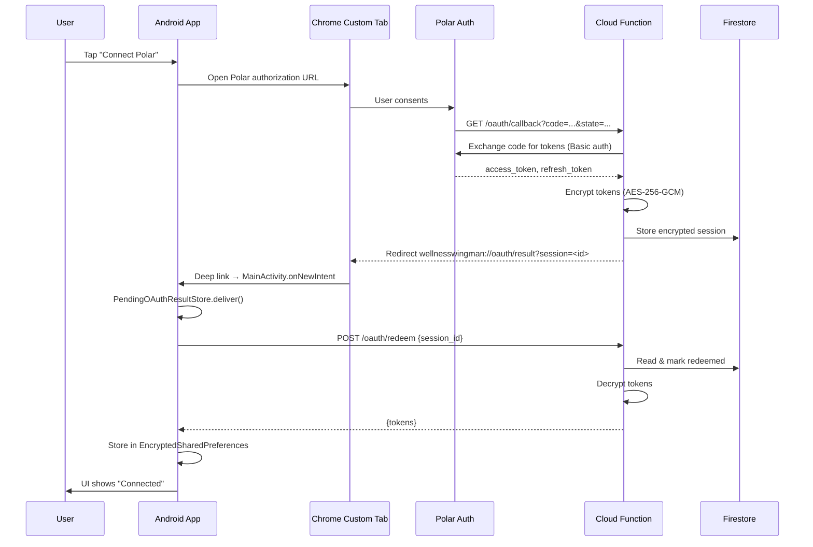

# Polar Integration

## Overview
WellnessWingman integrates with [Polar](https://www.polar.com/) fitness devices via Polar's AccessLink API. Authentication uses OAuth 2.0 with a server-side broker that keeps the client secret off the mobile device.

## Architecture



## Components

### Backend: `polar-oauth-broker/`

A Python Cloud Function (Google Cloud Functions gen2) with four routes:

| Route | Method | Purpose |
|-------|--------|---------|
| `/oauth/callback` | GET | Polar redirects here after user consent. Exchanges authorization code for tokens using Basic auth (Polar v4), encrypts tokens with AES-256-GCM, stores in Firestore, redirects to app via custom scheme. |
| `/oauth/redeem` | POST | App sends `{session_id}`. One-time pickup: decrypts tokens, returns JSON, marks session redeemed. Returns 410 on replay. |
| `/oauth/refresh` | POST | Stateless proxy: app sends `{refresh_token}`, broker forwards to Polar with client credentials, returns new tokens. No Firestore involved. |
| `/.well-known/assetlinks.json` | GET | Placeholder for future App Links verification. |

**Infrastructure** is managed with Terraform (`polar-oauth-broker/infra/`):
- Cloud Function gen2 (Python 3.12, 256MB, min-instances=0)
- Firestore with TTL policy on `oauth_sessions` (10-minute expiry)
- Secret Manager for `polar-client-secret` and `polar-oauth-session-key`
- Dedicated service account with `datastore.user` + `secretmanager.secretAccessor`
- Public invocation IAM (Polar must reach the callback)

### Android Client

**Token storage:** `EncryptedSharedPreferences` via `AppSettingsRepository` methods (`getPolarAccessToken`, `setPolarRefreshToken`, etc.). All Polar keys use the `polar_` prefix.

**Deep link flow:**
1. `MainActivity` has `singleTask` launch mode and an intent-filter for `wellnesswingman://oauth/result`
2. `handleOAuthDeepLink()` extracts `session` and `state` parameters
3. Delivers to `PendingOAuthResultStore` (in-memory `StateFlow` singleton)
4. `PolarSettingsViewModel` observes the store and auto-triggers session redemption

**Browser launch:** `OAuthBrowserLauncher` is an `expect`/`actual` composable. Android uses `CustomTabsIntent`, desktop is a no-op.

## Configuration

### Local development

Add to `local.properties` (see `local.properties.example`):

```properties
polar.client.id=your-polar-client-id
polar.broker.base.url=https://your-cloud-function-url
```

These become `BuildConfig.POLAR_CLIENT_ID` and `BuildConfig.POLAR_BROKER_BASE_URL`, provided to `PolarOAuthConfig` via Koin in `WellnessWingmanApp`.

### Backend deployment

```bash
cd polar-oauth-broker/infra
cp terraform.tfvars.example terraform.tfvars
# Edit terraform.tfvars with real values
terraform init
terraform apply
```

After initial apply, update the secret values:

```bash
echo -n "real-client-secret" | gcloud secrets versions add polar-client-secret --data-file=-
python3 -c "import os; print(os.urandom(32).hex())" | gcloud secrets versions add polar-oauth-session-key --data-file=-
```

## Verification

1. **Backend curl test:** Deploy function → open Polar auth URL in browser → consent → grab `session_id` from redirect → `curl -X POST <url>/oauth/redeem -H 'Content-Type: application/json' -d '{"session_id":"<id>"}'` → tokens returned → repeat → 410 Gone
2. **Migration test:** Install current app (plain prefs), then install updated build → verify settings preserved in encrypted prefs
3. **Deep link test:** `adb shell am start -a android.intent.action.VIEW -d "wellnesswingman://oauth/result?session=test&state=abc"` → verify `PendingOAuthResultStore` receives it
4. **End-to-end:** Tap Connect → Chrome Custom Tab → Polar consent → redirect → app shows "Connected" with user ID
5. **Disconnect:** Tap Disconnect → tokens cleared → UI shows "Connect" button

## AccessLink API v4 — Endpoint Features

The Polar AccessLink v4 data endpoints support an optional `features` query parameter
that controls which data is included in the response. Without `features`, most endpoints
return empty or minimal stubs. This has significant implications for the sync orchestrator.

### Currently implemented

| Endpoint | Features requested | Max range | Notes |
|----------|-------------------|-----------|-------|
| `activity/list` | `samples` | 28 days | Step samples as dense time-series (1-min intervals). Without `samples`, `activitiesPerDevice` is empty. |
| `sleeps` | `sleep-result`, `sleep-evaluation`, `sleep-score` | **1 day** | Returns hypnogram timing, phase durations, quality metrics, and Polar sleep scores. Without features, returns bare `{sleepDate}` stubs with no data. |
| `training-sessions/list` | _(none)_ | 90 days | Base response already includes HR, calories, distance, duration, recovery time, sport ID. No features needed for the core wellness data. |
| `nightly-recharge-results` | _(none — no features param)_ | 28 days | Returns HRV (RMSSD, R-R interval), ANS status, baselines, and recovery indicators. |
| `user/account-data` | _(none — no features param)_ | N/A | Profile endpoint, no date range. Returns physical info (resting HR, VO2max, weight, height, sleep goal). |

### Training sessions — deferred features

The training-sessions endpoint supports 12 optional features. When any features are
requested, the max date range drops to **1 day**, forcing day-by-day pagination. The base
response (no features) is already rich enough for the wellness dashboard, so we defer
these features to avoid the pagination complexity during initial sync.

| Feature | What it adds | Wellness value | Why deferred |
|---------|-------------|----------------|--------------|
| `training-load-report` | `cardioLoad`, `muscleLoad`, interpretations, `perceivedLoad`, `sessionRpe` | **High** — recovery/strain tracking, like Whoop strain score | 1-day limit. Best added when sync orchestrator supports day-by-day pagination. |
| `zones` | HR/power/speed zone distribution with `inZone` time (ms) per zone | **High** — shows training intensity distribution | 1-day limit. Large payload per session. |
| `statistics` | min/avg/max for altitude, cadence, HR, power, speed | Medium — summary stats already partially available in base response (`hrAvg`, `hrMax`) | 1-day limit. Partially redundant with base fields. |
| `samples` | Dense time-series (HR, speed, altitude, etc.) | Low for dashboard — useful for detailed session replay | 1-day limit. Very large payload. |
| `laps` | Lap splits with per-lap stats | Low | Niche use case. |
| `hill-splits` | Uphill/downhill segment analysis | Low | Niche use case. |
| `routes` | GPS track data | Low for wellness | Large payload, niche. |
| `test-results` | Fitness test results (orthostatic, etc.) | Medium | Rare — only present on test sessions. |
| `pause-times` | Pause/resume timestamps | Low | |
| `strength-training-results` | Sets, reps, weights per exercise | Medium for strength athletes | Niche. |
| `comments` | User notes on sessions | Low | |
| `physical-info` | Profile info per session | Low — available via `user/account-data` | Redundant. |

**Recommendation:** When the sync orchestrator is built, add `training-load-report` and
`zones` as a priority. The cardio/muscle load data combined with HR zone distribution
gives a complete training strain picture. The sync orchestrator will already need
day-by-day pagination for sleep, so extending it to training sessions is incremental.

### Activity — deferred features

| Feature | What it adds | Why deferred |
|---------|-------------|--------------|
| `activity-target` | Daily MET goal (`minDailyMetGoal`) | Low priority — can be derived from profile. |
| `physical-information` | Profile data repeated per day | Redundant — use `user/account-data` instead. |

### Sync orchestrator implications

The `features` parameter creates a two-tier pagination model:

- **Bulk sync** (activity, training, nightly recharge): multi-day ranges, fewer API calls
- **Detail sync** (sleep, future training features): 1-day max, requires day-by-day loop

The sync orchestrator should handle this transparently, batching bulk endpoints and
iterating daily for detail endpoints. Rate limiting (Polar enforces 429) should use
exponential backoff.

## Scope Boundaries (Milestone 1)

Not included in the initial implementation:
- No sync orchestrator / WorkManager / Polar data fetching
- No App Links verification (custom scheme only)
- No iOS support
- No Cloud Armor / rate limiting
- No `/start` endpoint (state generated on-device)
